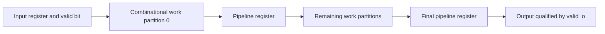
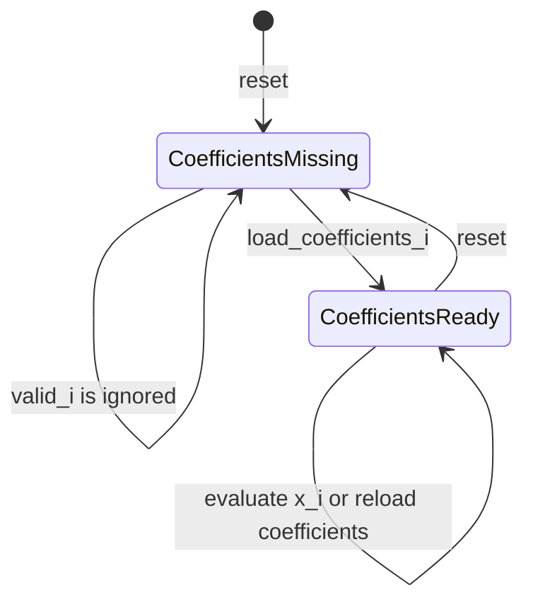

# Area and timing pipeline sweep

## When to consult this page

Use this page when changing either experimental datapath, the `PIPELINE_STAGES` partition rule, validity/reset behavior, GF arithmetic or coefficient ordering, or the interpretation of `examples/area-timing-sweep/results/`. Build and test commands live in [development workflows](../workflows/development.md), while the repository-level relationship to the other examples is in the [architecture overview](../architecture/overview.md).

## Experiment model

The example compares two fixed workloads while changing only the number of registered partitions:

- `arx_pipeline` applies `N_ROUNDS` add-rotate-XOR transformations to `(a_i, b_i)`. Defaults are 64 rounds, 32-bit words, and rotates by 5 and 11.
- `rs_chien_horner_pipeline` evaluates an `N_COEFFICIENTS` locator polynomial at `x_i` using Horner's method and `gf_multiply`. Defaults are 64 ten-bit coefficients and primitive polynomial `11'h409`.

Each generate loop computes integer boundaries as `(stage_index * work) / PIPELINE_STAGES` and `((stage_index + 1) * work) / PIPELINE_STAGES`. This distributes all operations in order, including uneven, non-power-of-two partitions. The public FuseSoC core exposes only `PIPELINE_STAGES`; changing other module parameters requires extending `area_timing_sweep.core` or another instantiation.

The partition boundaries change with `PIPELINE_STAGES`, but the total ordered operation sequence does not.

## Runtime contracts

Both modules use active-low asynchronous reset for validity state, have no ready/backpressure signal, and can sample one input every cycle. Payload registers are not reset, so outputs are meaningful only while `valid_o` is asserted. The input register plus each generated partition is registered; current cocotb tests deliberately compare FIFO order rather than asserting an exact cycle count.

The RS path has an additional lifecycle:

RS validity is gated by `coefficients_loaded`; reset clears that flag, and `load_coefficients_i` captures all coefficient slices in one clock edge.

Important invariants:

- Parameter guards require widths of at least two, nonzero work/stage counts, legal nonzero ARX rotates below `WORD_WIDTH`, and a primitive polynomial with highest and constant terms set.
- ARX wraps addition to `WORD_WIDTH`; rotations and XOR use the same width.
- RS coefficients are packed with coefficient zero in the least-significant `SYMBOL_WIDTH` slice. Horner evaluation consumes the highest indexed coefficient first.
- `root_o` is true only when `valid_o` is true and `value_o` is zero.
- Do not reload RS coefficients while values are in flight. The RTL permits it, but later partitions read the shared coefficient register and can therefore mix coefficient sets.

## Concept to source and tests

| Concept | Owning implementation | Narrow test evidence |
|---|---|---|
| ARX transform | `arx_pipeline.sv`: `rotate_left`, `arx_round` | `test_arx_pipeline.py`: `arx_model`, `test_arx_data_bringup` |
| Work partition and valid propagation | Both RTL modules: `gen_pipeline_stage`, `pipeline_valid` | Both `*_data_bringup` tests stream 12 consecutive inputs and drain in order |
| GF arithmetic and Horner order | `rs_chien_horner_pipeline.sv`: `gf_multiply`, `gen_horner_term` | `test_rs_chien_horner_pipeline.py`: `gf_multiply`, `polynomial_value` |
| Coefficient lifecycle and root flag | `coefficient_reg_proc`, `input_reg_proc`, `root_out` | `test_rs_data_bringup` loads once, checks ordinary points and roots 2 and 5 |
| Simulation surface | `area_timing_sweep.core`: `test_arx`, `test_rs`, `PIPELINE_STAGES` | FuseSoC runs the matching cocotb module with Verilator assertions and tracing |

The tests are bring-up coverage, not a full matrix. They do not currently exercise reset assertion, invalid elaboration parameters, valid gaps, exact latency, multiple stage counts, or RS input before load/reload while data is in flight. Add focused cases in the existing cocotb file when changing one of those behaviors.

## Results and reproducibility boundary

`results/sweep_1ghz.csv` and the split CSV/SVG files record 128 successful post-synthesis points: every integer pipeline depth from 1 through 64 for both workloads, targeting 1 GHz on ASAP7. The recorded environment used Hydra multirun, FuseSoC/OpenROAD, flat synthesis, the Slang frontend, and speed-oriented ABC mapping. These are post-synthesis estimates, not placed-and-routed signoff.

The observations show why all integer depths were sampled: ARX first and minimally meets 1 GHz at 32 stages, while RS first meets it at 13 stages but has a smaller passing mapping at 15 stages. Vectorless power excludes a physical clock tree and is useful only for relative exploration within this sweep.

The public repository checks in results and plots but not the Hydra configuration, OpenROAD target, or plot-generation source. Consequently:

- Do not hand-edit derived CSV/SVG files to match an RTL hypothesis.
- Ordinary RTL correctness requires the focused cocotb target, not external synthesis.
- Re-publishing area, timing, Pareto, or power claims requires recreating the external sweep with equivalent tool/platform constraints and updating `results/README.md` with provenance.

For path ownership and generated/derived boundaries, continue to the [source map](../source-map.md). For all available checks and current gaps, see the [testing runbook](../operations/testing-runbook.md).
